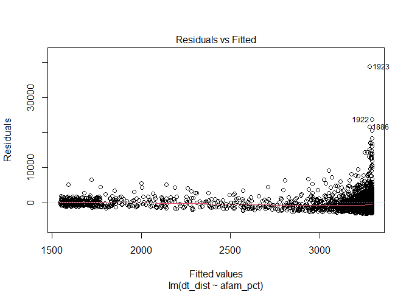
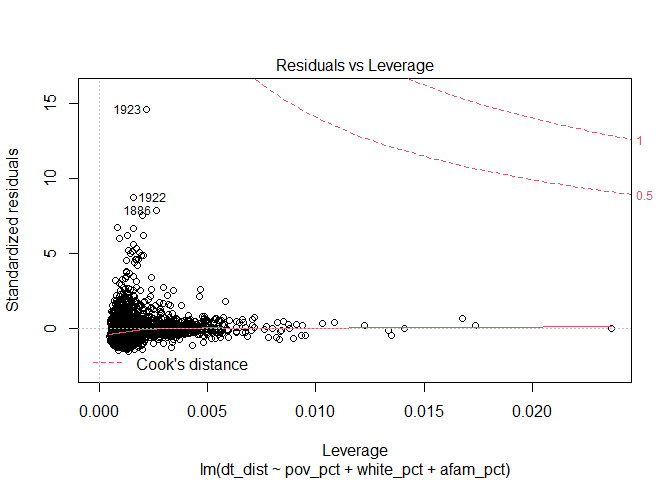

Geog6300: Final Project
================
Jerry Shannon

``` r
dollar_data <- st_read("data/geog4300_dollarstoredata.gpkg")
```

    ## Reading layer `geog4300_dollarstoredata' from data source `C:\Users\samsh\OneDrive\Documents\Productivity\College\GEOG4300 Data Science in GIS\Final Project\geog4-6300--final-project-SamShuster97\data\geog4300_dollarstoredata.gpkg' using driver `GPKG'
    ## Simple feature collection with 2080 features and 15 fields
    ## geometry type:  MULTIPOLYGON
    ## dimension:      XY
    ## bbox:           xmin: -88.8223 ymin: 40.88782 xmax: -87.02687 ymax: 42.63946
    ## geographic CRS: WGS 84

``` r
focused_data_sf<-dollar_data%>%
  select(totpop, white_pct, afam_pct, pov_pct, dt_dist)

focused_data<-dollar_data%>%
  as_tibble()%>%
  select(totpop, white_pct, afam_pct, pov_pct, dt_dist)
```

Use this template for your responses for the final project.

## Variables and research question (5 points)7

*In the space below, list the four variables you are using for this
analysis. The dependent variable should be one of the measures of dollar
store proximity. Explain why you’re choosing each variable–what
association do you think they might have with dollar store proximity?
Finally, write a research question that will be answered through your
analysis.*

`I will be conducting my analysis using:` \* pov\_pct: % of people with
household incomes below poverty level \* white\_pct: % of people
classified White, non-Hispanic \* afam\_pct: % of people classified
African-American, non-Hispanic \* dt\_dist: Distance to the closest
Dollar Tree in m

I chose to use the pov\_pct variable because I think it will provide
insight on how income influences corporate decision making pertaining to
the selection of new store locations as well as what sorts of
demographics are targeted in particular. Secondarily but also quite
important - modeling using this variable will highlight fiscal
inequities between race demographics in the region. I hypothesize that
higher income areas will have more dollar trees than lower income areas.

The afam\_pct variable was chosen in order to test whether dollar trees
are established in any discernible way according to racial distribution,
specifically, “Do stores open more or less frequently in areas with
high-percentage African-American populations?” I hypothesize that areas
of with high percentages of African-Americans will have fewer dollar
trees than predominantly white areas (10% or more African-American)

The dt\_dist variable was chosen as the dependent variable that will be
used to test correlation and regression between the previously mentioned
variables. This variable will provide insight pertaining to the
distribution of all dollar trees according to the above variables.
Testing only one particular chain will highlight any inequities in how
the corporation chooses where it will establish stores.

`Research Question 2: Does the Dollar Tree franchise establish stores in
particular areas with increased frequency based on its constituent
income and/or race demographics?`

Null hypothesis 1: there is a significant statistical bias towards store
establishment in particular areas based on race. Null hypothesis 2:
there is a significant statistical bias towards store establishment in
particular areas based on income. Alternative hypothesis 1: there is no
statistical bias towards store establishment in particular areas based
on race. Alternative hypothesis 2: there is a significant statistical
bias towards store establishment in particular areas based on income

## Descriptive analysis (10 points)

*Describe the central tendency (e.g., mean, median, mode), statistical
distribution (e.g., standard deviation and/or IQR), normality, and
spatial distribution of each variable using the techniques we have
covered in class. Describe any notable patterns you see in these
variables based on this analysis.*

`Central Tendency and basic Statistics:`

``` r
mean_pov_pct<-round(mean(focused_data$pov_pct, na.rm = TRUE), digits = 2)
median_pov_pct<-median(focused_data$pov_pct, na.rm=TRUE)

mean_wht_pct<-round(mean(focused_data$white_pct, na.rm = TRUE), digits = 2)
median_wht_pct<-round(median(focused_data$white_pct, na.rm=TRUE), digits = 2)

mean_afam_pct<-round(mean(focused_data$afam_pct, na.rm = TRUE), digits = 2)
median_afam_pct<-round(median(focused_data$afam_pct, na.rm=TRUE), digits = 2)
```

The mean percentage of people under the poverty line is 15.09% and the
median is 10.7%. The mean percentage of people who are white is almost
half, with a value of 48.94% and a median of 55.4%. The mean percentage
of people who are African-American is 21.37% with a median value of
4.6%.

``` r
ggqqplot(dollar_data$white_pct, title = "Percent White", color = "darkslategrey", xlab = "Theoretical", ylab = "Sample")
```

<!-- -->

``` r
hist(dollar_data$white_pct)
```

<!-- -->

``` r
wilcox.test(dollar_data$white_pct, dollar_data$white_pct)
```

    ## 
    ##  Wilcoxon rank sum test with continuity correction
    ## 
    ## data:  dollar_data$white_pct and dollar_data$white_pct
    ## W = 2163200, p-value = 1
    ## alternative hypothesis: true location shift is not equal to 0

``` r
model_pov = lm(dt_dist~pov_pct, data = dollar_data)
summary(model_pov)
```

    ## 
    ## Call:
    ## lm(formula = dt_dist ~ pov_pct, data = dollar_data)
    ## 
    ## Residuals:
    ##    Min     1Q Median     3Q    Max 
    ##  -3325  -1556   -591    686  39160 
    ## 
    ## Coefficients:
    ##             Estimate Std. Error t value Pr(>|t|)    
    ## (Intercept) 3587.560     91.210   39.33   <2e-16 ***
    ## pov_pct      -44.361      4.588   -9.67   <2e-16 ***
    ## ---
    ## Signif. codes:  0 '***' 0.001 '**' 0.01 '*' 0.05 '.' 0.1 ' ' 1
    ## 
    ## Residual standard error: 2708 on 2077 degrees of freedom
    ##   (1 observation deleted due to missingness)
    ## Multiple R-squared:  0.04308,    Adjusted R-squared:  0.04262 
    ## F-statistic:  93.5 on 1 and 2077 DF,  p-value: < 2.2e-16

``` r
plot(model_pov)
```

<!-- --><!-- --><!-- --><!-- -->

Based on the QQ plot and histogram for the white\_pct variable, the data
is not normally distributed. It is skewed both positively and negatively
which indicates that there is no definitive correlation that can be
extrapolated only given the two variable tested (white\_pct and
dt\_dist). The positive skew may indicate that there is a tendency for
stores to be established in areas that are not predominantly white.
Conversely, the opposite could be said concerning the negative skew -
stores tend to be established in predominantly white areas. Given this
mixed interpretation, there does not seem to be an obvious statistical
correlation between the two variables.

``` r
ggqqplot(dollar_data$afam_pct, title = "Percent Black", color = "slateblue", xlab = "Theoretical", ylab = "Sample")
```

<!-- -->

``` r
hist(dollar_data$afam_pct)
```

<!-- -->

``` r
wilcox.test(dollar_data$afam_pct, dollar_data$afam_pct)
```

    ## 
    ##  Wilcoxon rank sum test with continuity correction
    ## 
    ## data:  dollar_data$afam_pct and dollar_data$afam_pct
    ## W = 2163200, p-value = 1
    ## alternative hypothesis: true location shift is not equal to 0

``` r
model_wht = lm(dt_dist~white_pct, data = dollar_data)
summary(model_wht)
```

    ## 
    ## Call:
    ## lm(formula = dt_dist ~ white_pct, data = dollar_data)
    ## 
    ## Residuals:
    ##    Min     1Q Median     3Q    Max 
    ##  -3876  -1444   -412    743  37884 
    ## 
    ## Coefficients:
    ##             Estimate Std. Error t value Pr(>|t|)    
    ## (Intercept) 1410.236    104.631   13.48   <2e-16 ***
    ## white_pct     30.836      1.796   17.17   <2e-16 ***
    ## ---
    ## Signif. codes:  0 '***' 0.001 '**' 0.01 '*' 0.05 '.' 0.1 ' ' 1
    ## 
    ## Residual standard error: 2590 on 2078 degrees of freedom
    ## Multiple R-squared:  0.1243, Adjusted R-squared:  0.1238 
    ## F-statistic: 294.8 on 1 and 2078 DF,  p-value: < 2.2e-16

``` r
plot(model_wht)
```

<!-- --><!-- --><!-- --><!-- -->

The QQ plot and histogram for the afam\_pct variable has a similar
pattern to the white\_pct variable, however, the magnitude of
observations plays an important part in interpretation. There is a
strong positive skew which may indicate that Dollar Trees tend to be
opened more frequently in areas that are primarily occupied by
African-Americans. However, the strong negative skew may refute that
claim. No definitive interpretation can be made based on these figure
alone.

``` r
ggqqplot(dollar_data$pov_pct, title = "Poverty Percentage", color = "orange", xlab = "Theoretical", ylab = "Sample")
```

    ## Warning: Removed 1 rows containing non-finite values (stat_qq).

    ## Warning: Removed 1 rows containing non-finite values (stat_qq_line).
    
    ## Warning: Removed 1 rows containing non-finite values (stat_qq_line).

<!-- -->

``` r
hist(dollar_data$pov_pct)
```

<!-- -->

``` r
wilcox.test(dollar_data$pov_pct, dollar_data$pov_pct)
```

    ## 
    ##  Wilcoxon rank sum test with continuity correction
    ## 
    ## data:  dollar_data$pov_pct and dollar_data$pov_pct
    ## W = 2161121, p-value = 1
    ## alternative hypothesis: true location shift is not equal to 0

``` r
model_blk = lm(dt_dist~afam_pct, data = dollar_data)
summary(model_blk)
```

    ## 
    ## Call:
    ## lm(formula = dt_dist ~ afam_pct, data = dollar_data)
    ## 
    ## Residuals:
    ##    Min     1Q Median     3Q    Max 
    ##  -3203  -1565   -601    738  38820 
    ## 
    ## Coefficients:
    ##             Estimate Std. Error t value Pr(>|t|)    
    ## (Intercept) 3292.317     71.280  46.189   <2e-16 ***
    ## afam_pct     -17.461      1.843  -9.475   <2e-16 ***
    ## ---
    ## Signif. codes:  0 '***' 0.001 '**' 0.01 '*' 0.05 '.' 0.1 ' ' 1
    ## 
    ## Residual standard error: 2710 on 2078 degrees of freedom
    ## Multiple R-squared:  0.04141,    Adjusted R-squared:  0.04095 
    ## F-statistic: 89.77 on 1 and 2078 DF,  p-value: < 2.2e-16

``` r
plot(model_blk)
```

<!-- --><!-- --><!-- --><!-- -->

There is a strong positive skew for the pov\_pct variable which
indicates that stores may in fact be established with increased
frequency in low income areas. Significant finding.

The p-value in this case is far smaller than 0.05 which means it is
statistically significant enough to accept the null hypothesis.
Therefore, we reject the null hypothesis and accept the alternative
hypothesis in this particular case. The household data from the two
cities does not differ significantly.

``` r
ggqqplot(dollar_data$dt_dist, title = "Dollar Tree Dist", color = "chartreuse2", xlab = "Theoretical", ylab = "Sample")
```

<!-- -->

``` r
hist(dollar_data$dt_dist)
```

<!-- -->

``` r
shapiro.test(dollar_data$dt_dist)
```

    ## 
    ##  Shapiro-Wilk normality test
    ## 
    ## data:  dollar_data$dt_dist
    ## W = 0.67405, p-value < 2.2e-16

``` r
#lq_dollar_data = dollar_data %>%
 # mutate(dt_lq = n(dt_dist)/2080)

#dollar_data_ll <- st_transform(dollar_data, "+proj=longlat +ellps=WGS84 +datum=WGS84")
```

``` r
tm_shape(dollar_data)+
  tm_fill("medinc", style = "fisher")+
  tm_borders()+
  tm_basemap(server="OpenStreetMap",alpha=0.5)
```

<!-- -->

``` r
tm_shape(dollar_data)+
  tm_fill("medinc", style = "fisher", palette="-RdBu")+
  tm_borders()+
  tm_basemap(server="OpenStreetMap",alpha=0.5)
```

<!-- -->

The medinc variable was mapped in order to gain a more in-depth
understanding of how stores might be distributed. This is not a
necessary component of the study but was done despite that.

``` r
tm_shape(dollar_data)+
  tm_fill("pov_pct", style = "fisher")+
  tm_borders()+
  tm_basemap(server="OpenStreetMap",alpha=0.5)
```

<!-- -->

The above map shows the distribution of the percentage of people below
the poverty line. Darker colors indicate more impoverished areas. The
most impoverished areas appear to be in the eastern-most and the
south-central areas with other hot-spots dotted around the perimeter of
the city.

``` r
tm_shape(dollar_data)+
  tm_polygons("white_pct", style = "fisher")+
  tm_basemap(server="OpenStreetMap",alpha=0.5)
```

<!-- -->

``` r
tm_shape(dollar_data)+
  tm_polygons("white_pct", style = "fisher", palette="-RdBu")+
  tm_basemap(server="OpenStreetMap",alpha=0.5)
```

<!-- -->

The above show the spatial distribution of areas with varying
percentages of people living within them classified as white. Two
different color schemes are used for clarity. The city center appears to
be a rather diverse area, although it appears as though few white people
live in the south-central area. There is significant homogeneity the
further one travels from the city center/the eastern border of the city.

``` r
tm_shape(dollar_data)+
  tm_polygons("afam_pct", style = "fisher")+
  tm_basemap(server="OpenStreetMap",alpha=0.5)
```

<!-- -->

``` r
tm_shape(dollar_data)+
  tm_polygons("afam_pct", style = "fisher", palette="RdBu")+
  tm_basemap(server="OpenStreetMap",alpha=0.5)
```

<!-- -->

The above show the spatial distribution of areas with varying
percentages of people living within them classified as African-American.
Two different color schemes are used for clarity. The south-central
portion of the city appears to be primarily inhabited by
African-Americans. An overwhelming majority of African-Americans living
in the city live within the South-central area.

``` r
tm_shape(dollar_data)+
  tm_polygons("dt_dist", breaks=c(0,500,1000,3000,5000,7000,10000,50000))
```

<!-- -->

Based on the maps created above, we can see that the further one travels
from the Eastern edge of the city (which is essentially the city
center), we see that dollar tree distances increase. This indicates that
Dollar Trees are predominantly located within the city center. The
classification breakdown is as such: 0-0.5km, 0.5-1km, 1-3km, 3-5km,
5-7km, 7-10km, and 10-50km. This resolution of analysis takes
transportation into consideration. Given the nature of the study, access
to stores is incumbent upon the ability to travel to a location. Those
who are not financially privileged are limited by distance so stores
within walking distance are the most accessible.

There is no obvious trend in store distribution based on race alone. The
majority of stores tend to be located well within the bounds of the city
limits, predominantly occupying the central portion of the city. Given
the diversity of the city center, no obvious bias towards establishing
stores areas based on race.

## Inferential statistics (10 points)

*Create a multivariate regression model that assesses the relationship
between your independent and dependent variables. Check for
multicollinearity and the potential effect of outliers. Also check
whether the residuals have a random distribution both statistically and
spatially. Discuss what model diagnostics tell you about the validity of
the model.*

``` r
model_multivar = lm(dt_dist~pov_pct + white_pct + afam_pct, data = dollar_data)
summary(model_multivar)
```

    ## 
    ## Call:
    ## lm(formula = dt_dist ~ pov_pct + white_pct + afam_pct, data = dollar_data)
    ## 
    ## Residuals:
    ##    Min     1Q Median     3Q    Max 
    ##  -3996  -1431   -376    731  37625 
    ## 
    ## Coefficients:
    ##             Estimate Std. Error t value Pr(>|t|)    
    ## (Intercept)  550.803    233.508   2.359   0.0184 *  
    ## pov_pct       16.207      6.612   2.451   0.0143 *  
    ## white_pct     40.475      2.919  13.866   <2e-16 ***
    ## afam_pct       6.667      2.624   2.541   0.0111 *  
    ## ---
    ## Signif. codes:  0 '***' 0.001 '**' 0.01 '*' 0.05 '.' 0.1 ' ' 1
    ## 
    ## Residual standard error: 2581 on 2075 degrees of freedom
    ##   (1 observation deleted due to missingness)
    ## Multiple R-squared:  0.1315, Adjusted R-squared:  0.1302 
    ## F-statistic: 104.7 on 3 and 2075 DF,  p-value: < 2.2e-16

``` r
plot(model_multivar)
```

<!-- --><!-- --><!-- --><!-- -->

``` r
mv_residuals = residuals(model_multivar)
summary(mv_residuals)
```

    ##    Min. 1st Qu.  Median    Mean 3rd Qu.    Max. 
    ## -3995.6 -1431.2  -375.8     0.0   731.4 37624.5

``` r
ggqqplot(mv_residuals, title = "Multivariate Regression Model", xlab = "Theoretical", ylab = "Sample")
```

<!-- -->

``` r
vif(model_multivar)
```

    ##   pov_pct white_pct  afam_pct 
    ##  2.286264  2.660467  2.235622

``` r
bptest(model_multivar)
```

    ## 
    ##  studentized Breusch-Pagan test
    ## 
    ## data:  model_multivar
    ## BP = 51.21, df = 3, p-value = 4.412e-11

## Discussion (5 points)

*Based on your results, interpret the results of your model, focusing on
the direction, magnitude, and significance of each variable and the
overall power of the model. Based on this analysis, what answer can you
give to your research question? What limitations or problems does your
analysis have that should be addressed in the future?*

The QQ plot of residuals indicates a strong skew which is to be expected
from non-parametric data, however, the plot is mostly normal which
indicates that the variables used are effective for statistical
analysis. The skew is strongly in the negative direction with some high
outliers at the upper end of the distribution.

Based on early findings alone, my hypothesis could not be supported.
Based on the multiple R-squared value, only 13% of the variation in the
model can be explained by these variables. From the multivariate
regression model, a statistically significant level of correlation is
supported between the variables assessed and store location
establishment. That said, the R-squared value is not particularly large
so this model may not be the best fit. The most influential variable
appears to be white\_pct. The model is most heavily influenced by this
variable, indicated by the highly significant p-value. This is likely in
part because of the large white population in the city, which
subsequently may have skewed the model. The statistical significance
could be mere coincidence as a result. The p-values for the other two
variables are still statistically significant but to a lesser degree.
They still support both null hypotheses given their significance.
Somewhat surprisingly, the impoverished areas did not have greater or
diminished access to the Dollar Trees.

The multiple R-squared is 0.1315 while the Adjusted R-squared is 0.1302.
The lack of change in the adjusted R-squared indicates that the
statistical significance is illusory.

Results from vif test returned a value less than 4 which indicates a low
level of multicollineraity.

Ultimately, we can conclude that this model does not statistically prove
a bias towards the establishment of Dollar Trees in particular areas
based on race or income. Despite significant p-values and a seemingly
significant model, the fact that the adjusted R-squared variable is
smaller than the un-adjusted indicates misleading results. I think one
limitation of this analysis was the absence of point data explicitly
detailing store locations. I think that data would have been helpful for
providing an even finer resolution to conduct analysis. Additionally, a
longer list of variables to chose from to conduct the analysis might
have offered unexpected yet significant findings - some examples might
include zoning classification data or proximity to certain
infrastructure features like bus or train stations. As far as my
individual analysis goes, I feel i was somewhat limited in my ability to
create visualizations. In future, I would include figures like a kernel
density map.
